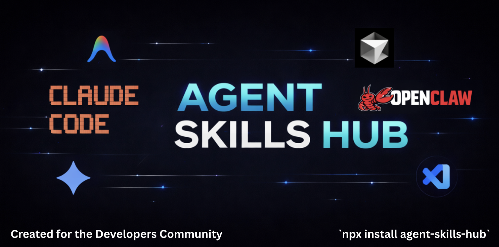

<a id="readme-top"></a>


[![Contributors][contributors-shield]][contributors-url]
[![Forks][forks-shield]][forks-url]
[![Stargazers][stars-shield]][stars-url]
[![Issues][issues-shield]][issues-url]
[![MIT License][license-shield]][license-url]
[![npm version][npm-shield]][npm-url]

<br />
<div align="center">



  <h3 align="center">Agent Skills Hub</h3>

  <p align="center">
    The universal registry of agentic skills for AI coding agents.
    <br />
    <strong>631+ skills</strong> for OpenClaw, Claude Code, Cursor, Gemini, and other agent frameworks.
    <br />
    <br />
    <a href="#getting-started"><strong>Install Now »</strong></a>
    <br />
    <br />
    <a href="#usage">View Demos</a>
    &middot;
    <a href="https://github.com/legendaryabhi/agent-skills-hub/issues">Report Bug</a>
    &middot;
    <a href="https://github.com/legendaryabhi/agent-skills-hub/issues">Request Feature</a>
  </p>
</div>


<!-- TABLE OF CONTENTS -->
<details>
  <summary>Table of Contents</summary>
  <ol>
    <li>
      <a href="#about-the-project">About The Project</a>
      <ul>
        <li><a href="#why-agent-skills">Why Agent Skills?</a></li>
        <li><a href="#built-with">Built With</a></li>
      </ul>
    </li>
    <li>
      <a href="#getting-started">Getting Started</a>
      <ul>
        <li><a href="#prerequisites">Prerequisites</a></li>
        <li><a href="#installation">Installation (NPX)</a></li>
      </ul>
    </li>
    <li><a href="#usage">Usage</a></li>
    <li><a href="#skill-catalog">Skill Catalog</a></li>
    <li><a href="#roadmap">Roadmap</a></li>
    <li><a href="#contributing">Contributing</a></li>
    <li><a href="#license">License</a></li>
  </ol>
</details>


## About The Project

**Agent Skills Hub** is a centralized, open-source registry of **agentic skills** — reusable, structured instructions that teach AI agents *how to actually do things correctly*.

Think of skills as **plugins for reasoning**:
- They encode **best practices**
- They define **tool usage**
- They enforce **project-specific workflows**

This repository is shipped as an **NPX-first CLI**, making skills instantly installable into popular agent environments.

> If prompts are *what* to do,  
> **skills are *how* to do it right.**

<p align="right">(<a href="#readme-top">back to top</a>)</p>


### Why Agent Skills?

Modern AI agents are powerful generalists, but they lack:

- Repo-specific context  
- Tooling conventions  
- Deployment workflows  
- Organizational standards  

**Agent Skills solve this gap.**

Each skill is a Markdown-based definition that can teach an agent:
- How to write production-ready code
- How to use a specific CLI or API
- How to follow your internal processes
- How to reason consistently across tasks

Skills work across **OpenClaw, Claude Code, Cursor, Gemini CLI**, and more.

<p align="right">(<a href="#readme-top">back to top</a>)</p>


### Built With

* [![JavaScript][javascript-shield]][javascript-url]
* [![Node.js][nodejs-shield]][nodejs-url]
* [![Python][python-shield]][python-url]
* [![Shell][shell-shield]][shell-url]
* [![Markdown][markdown-shield]][markdown-url]

<p align="right">(<a href="#readme-top">back to top</a>)</p>


## Getting Started

### Prerequisites

- Node.js
- npm / npx
- Any supported agent framework (optional)


### Installation

The fastest way to get started is via **NPX**.

```bash
# Install skills globally (default: ~/.agent/skills)
npx agent-skills-hub
````

#### Targeted Installs

```bash
# Cursor
npx agent-skills-hub --cursor

# Claude Code
npx agent-skills-hub --claude

# OpenClaw
npx agent-skills-hub --openclaw
```

#### Install a Specific Skill

```bash
npx agent-skills-hub install react-patterns
npx agent-skills-hub install react-patterns --cursor
```

#### Manual Clone (Advanced)

```bash
git clone https://github.com/legendaryabhi/agent-skills-hub.git ~/.agent/skills
```

<p align="right">(<a href="#readme-top">back to top</a>)</p>

## Usage

Usage depends on your agent framework.

### OpenClaw

OpenClaw automatically loads skills from:

```bash
~/.openclaw/skills
```

Once installed, skills are injected at runtime.

### Claude Code

Claude Code reads skills from:

```bash
~/.claude/skills
```

Example:

```text
/load @react-best-practices
Help me refactor this component using the loaded patterns.
```


### Cursor / VS Code

1. Install skills to:

   ```bash
   ~/.cursor/skills
   ```
2. Reference them in chat:

   ```text
   @react-best-practices How should I structure this useEffect?
   ```


### Demos

You can add:

* CLI recordings (asciinema)
* GIF walkthroughs
* Real agent transcripts

> PRs with demos are highly welcome.

<p align="right">(<a href="#readme-top">back to top</a>)</p>


## Skill Catalog

We currently maintain **630+ skills** across multiple domains.

👉 **Browse the full catalog:**
[CATALOG.md](CATALOG.md)

### Category Highlights

* **Architecture**: `system-design`, `c4-model`, `microservices`
* **Development**: `react-patterns`, `typescript-expert`, `python-optimization`
* **Security**: `owasp-top-10`, `pentest-checklist`
* **Ops & Cloud**: `docker-mastery`, `kubernetes-debug`
* **Business**: `seo-audit`, `startup-analysis`

<p align="right">(<a href="#readme-top">back to top</a>)</p>


## Roadmap

* [x] NPX-based installer
* [x] Multi-agent support
* [x] 600+ curated skills
* [ ] Skill versioning
* [ ] Skill dependency graph
* [ ] Web catalog explorer
* [ ] Agent marketplace integrations

See the [open issues](https://github.com/legendaryabhi/agent-skills-hub/issues).

<p align="right">(<a href="#readme-top">back to top</a>)</p>


## Contributing

We’re building the **open standard for agent skills**.

1. Fork the repo
2. Create a `SKILL.md`:
3. Submit a PR

See [CONTRIBUTING.md](CONTRIBUTING.md) for full guidelines.

<p align="right">(<a href="#readme-top">back to top</a>)</p>


## License

Distributed under the **MIT License**.
See `LICENSE` for details.

<p align="right">(<a href="#readme-top">back to top</a>)</p>


<!-- MARKDOWN LINKS -->

[npm-shield]: https://img.shields.io/npm/v/agent-skills-hub.svg?style=for-the-badge
[npm-url]: https://www.npmjs.com/package/agent-skills-hub
[contributors-shield]: https://img.shields.io/github/contributors/legendaryabhi/agent-skills-hub.svg?style=for-the-badge
[contributors-url]: https://github.com/legendaryabhi/agent-skills-hub/graphs/contributors
[forks-shield]: https://img.shields.io/github/forks/legendaryabhi/agent-skills-hub.svg?style=for-the-badge
[forks-url]: https://github.com/legendaryabhi/agent-skills-hub/network/members
[stars-shield]: https://img.shields.io/github/stars/legendaryabhi/agent-skills-hub.svg?style=for-the-badge
[stars-url]: https://github.com/legendaryabhi/agent-skills-hub/stargazers
[issues-shield]: https://img.shields.io/github/issues/legendaryabhi/agent-skills-hub.svg?style=for-the-badge
[issues-url]: https://github.com/legendaryabhi/agent-skills-hub/issues
[license-shield]: https://img.shields.io/github/license/legendaryabhi/agent-skills-hub.svg?style=for-the-badge
[license-url]: https://github.com/legendaryabhi/agent-skills-hub/blob/main/LICENSE
<!-- Built With Badges -->
[javascript-shield]: https://img.shields.io/badge/JavaScript-F7DF1E?style=for-the-badge&logo=javascript&logoColor=000
[javascript-url]: https://developer.mozilla.org/en-US/docs/Web/JavaScript

[nodejs-shield]: https://img.shields.io/badge/Node.js-339933?style=for-the-badge&logo=nodedotjs&logoColor=white
[nodejs-url]: https://nodejs.org/

[python-shield]: https://img.shields.io/badge/Python-3776AB?style=for-the-badge&logo=python&logoColor=white
[python-url]: https://www.python.org/

[shell-shield]: https://img.shields.io/badge/Shell-4EAA25?style=for-the-badge&logo=gnu-bash&logoColor=white
[shell-url]: https://www.gnu.org/software/bash/

[markdown-shield]: https://img.shields.io/badge/Markdown-000000?style=for-the-badge&logo=markdown&logoColor=white
[markdown-url]: https://www.markdownguide.org/
